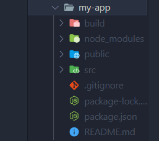
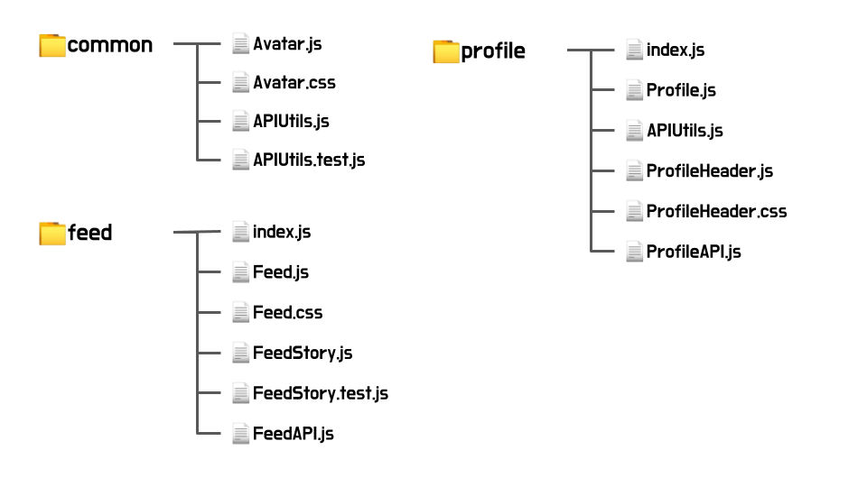
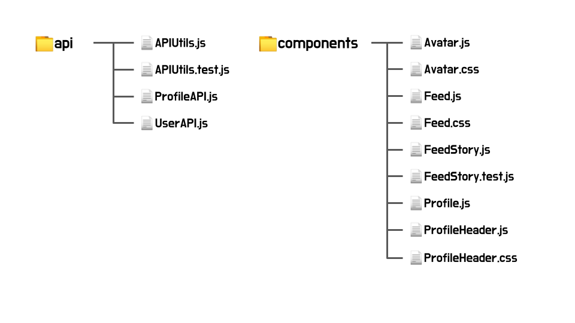
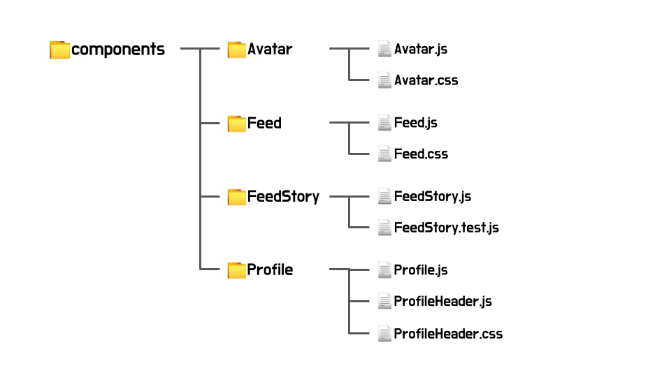
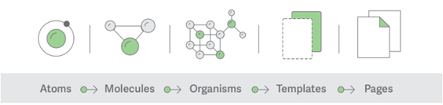

# React 프로젝트의 디렉토리 구조

작성일: 2022/06/23

<aside>
📂 설명이 잘 이해되지 않거나, 모르는 용어가 나올 때는 반드시 말씀해주세요 :- )

</aside>

## 들어가며

리액트 프로젝트 환경을 셋팅할 때 `npx create-react-app {프로젝트 이름}` 명령을 많이 사용하곤 합니다.

명령어를 입력하고 Enter를 치면 `{프로젝트 이름}` 폴더의 하위로 여러 파일들이 생성되는데요.



프로젝트를 개발해나가면서 src 폴더 아래에는 점점 많은 파일들이 생성됩니다.

- 작게 작게 쪼갠 수많은 리액트 컴포넌트들
- 컴포넌트들을 합성해 화면을 보여주는 페이지(이것 역시 컴포넌트지만요)
- 컴포넌트에 사용되는 각종 이미지들

등등… **여러 파일들이 생성되면서 폴더의 복잡도는 점점 올라가는데요**. 

스마트폰으로 사진을 찍고 분류를 해두지 않으면 나중에 원하는 사진을 찾기 힘든 것처럼, 개발을 진행하면서 파일을 분류하지 않으면 작업을 어렵게 만듭니다.

그래서 우리는 프로젝트를 시작하기 전에, 프로젝트를 잘 구조화해서 설계할 필요가 있고, 또 그에 알맞은 작업환경을 만들어야 합니다. 그 활동 중 일환으로 오늘 프로젝트 디렉토리 구조에 대해 알아봅시다.

---

## React 프로젝트의 디렉토리 구조

프론트엔드/백엔드 어느 부분을 개발하는지, 어떤 언어를 사용하는지에 따라서 적합한 디렉토리 구조가 모두 다른데요.

리액트 프로젝트의 경우 어떤 디렉토리 구조로 개발해야 할까요?

공식 문서에는 어떤 방법을 권장하고 있는지 살펴봅시다.

[파일 구조 - React](https://ko.reactjs.org/docs/faq-structure.html)

> ***Q. React 프로젝트 구조를 설계하기 위해 추천할 만한 방법이 있을까요?***
> 
> 
> 
> **React는 파일을 어떤 식으로 폴더에 분류할 것인지에 대해서 제시하고 있지는 않습니다.** 그러나 React 생태계 내에서 고려할만한 몇 가지 인기 있는 **일반적인 접근법**들이 있습니다…
> 

보시다시피, 리액트는 올바른 디렉토리 구조를 정하고 있지 않으며, 그 대신에 대중적으로 사용되는 접근법들에 대해서 소개하고 있습니다.

### 1. 파일의 기능이나 라우트에 의한 분류

첫째, **파일의 `기능`이나 `라우트`에 의한 분류입니다.**

공식문서 페이지에 나와 있는 예제 코드를 살펴보겠습니다.

```jsx
common/
  Avatar.js
  Avatar.css
  APIUtils.js
  APIUtils.test.js
feed/
  index.js
  Feed.js
  Feed.css
  FeedStory.js
  FeedStory.test.js
  FeedAPI.js
profile/
  index.js
  Profile.js
  ProfileHeader.js
  ProfileHeader.css
  ProfileAPI.js
```

세 개의 폴더로 파일들이 묶여 있는데요. 

트리 형태의 그림으로 표현을 하면 아래와 같습니다.



- `common 폴더`는 아바타, API 유틸같이 **프로젝트 내부에서 공통적으로 사용할 수 있는 파일**들이 모여있습니다.
- `feed 폴더`는 **Feed, FeedStrory 등…** 어플리케이션의 홈 피드를 구성하는 파일들이라는 것을 유추해볼 수 있겠습니다.
- `profile 폴더`는 ProfileHeader, Profile 등의 컴포넌트들과, 그 과정중 사용되는 API가 담겨있습니다.

홈 피드 같은 특정한 `페이지`, 프로필 같은 특정 `기능`들을 한 폴더 안에 묶어놓은 것이 보이시죠? **서로 연관성이 있는 파일들끼리 분류**되어 있어 **이해하기 쉽습니다**. 

하지만 기능을 **얼마나 컴포넌트화 하느냐(얼마나 쪼개느냐)에 따라** `디렉토리 안의 파일이 너무 많아지거나` / `디렉토리가 중첩되어 뎁스(depth)가 깊어져 복잡도가 증가`할 수 있습니다.

### 2. 파일 유형에 의한 분류

프로젝트는 `비슷한 파일끼리 묶어주는 방식`으로도 구조화할 수 있습니다.

```jsx
api/
  APIUtils.js
  APIUtils.test.js
  ProfileAPI.js
  UserAPI.js
components/
  Avatar.js
  Avatar.css
  Feed.js
  Feed.css
  FeedStory.js
  FeedStory.test.js
  Profile.js
  ProfileHeader.js
  ProfileHeader.css
```

그림으로 표현하면 아래와 같습니다.



- `api 폴더`에는 API 유틸과 함께 각 기능의 API들이 있습니다.
- `components 폴더`에는 하나의 컴포넌트를 구성하는 js 파일과 css 파일이 묶여있습니다.

api는 api끼리, component는 component끼리 묶는 방식은 기능에 따라 분류하는 것보다 **단순**하지만, 훨씬 **포괄적**이어서 파일이 많아질수록 혼잡하다는 단점이 있습니다. 

그래서 실무에서는 이런 방법들을, 혹은 개발자가 스스로 고안한 방법을 섞어서 사용하게 됩니다. 

예를 들어, 1번 **파일의 기능이나 라우트에 의한 분류**와 2번 **파일 유형에 의한 분류**를 결합하면 아래와 같은 형태가 되겠습니다.



멋사 수업에서 많이 사용해본 구조여서 다들 익숙하실거에요!

> ❓ 여기서 질문! **여러분은 이러한 구조를 사용하셨을 때 어떠셨나요?**


- 제가 느끼기로는 이렇습니다. 
>
    **장점**
    - 파일을 import하기 쉬웠다
    - 관련있는 css, js(jsx) **파일**이 엮여있어 작업하기 수월했다
    
    **단점**
    - **컴포넌트들** 간의 관계를 파악하기 어려웠다
    - 컴포넌트의 개수가 많아질수록 원하는 컴포넌트를 찾기 힘들었다. 끝없는 스크롤 속에서 눈빠지게 찾기.
    

혜원 : 비슷한 것끼리 묶다보니 편하긴 했는데, 너무 세부적으로 나누면 오히려 복잡했다

보람 : 저도 묶어놨을 때 보기 편했는데… 불편한 점은 못 느꼈다

도희 : 좋았따

우리가 느끼는 문제점들을 개선하기 위해서, **우리에게 맞는 프로젝트 구조를 찾아가는 게 좋겠습니다**. 

## 다른 사람들은 어떤 구조를 사용하고 있을까?

우리의 레퍼런스가 될 법한 예시를 몇 가지 들고왔습니다.

### 레퍼런스의 src 폴더 구조


📂 [React Architecture: How to Structure and Organize a React Application](https://www.taniarascia.com/react-architecture-directory-structure/)

- `assets` : 전역 정적 파일들(이미지, 로고, 아이콘 등)
- `components` : form 요소(button, text 등), 레이아웃 요소(wrapper, nav 등)와 같은 재사용 가능한 컴포넌트들
- `services` : 자바스크립트 모듈, api 모듈
- `store` : redux, recoil 전역 상태
- `utils` : 프로젝트에 이용되는 함수, 기능들(helpers, 상수 등)
- `views(pages)` : 라우팅을 통해 전환되는 페이지 자체


📂 [리액트 아키텍처 패턴 (React Architecture Patterns)](https://velog.io/@sitaruta/%EB%A6%AC%EC%95%A1%ED%8A%B8-%EC%95%84%ED%82%A4%ED%85%8D%EC%B2%98-%ED%8C%A8%ED%84%B4-React-Architecture-Patterns)

- `assets`
- `components`
- **`context` : 전역 상태 관리**
- **`hooks` : 리액트 훅, 커스텀 훅**
- `pages`
- `services`
- `utils`


📂 [[react] 리액트 프로젝트의 폴더구조](https://velog.io/@raverana96/react-%EB%A6%AC%EC%95%A1%ED%8A%B8-%ED%94%84%EB%A1%9C%EC%A0%9D%ED%8A%B8%EC%9D%98-%ED%8F%B4%EB%8D%94%EA%B5%AC%EC%A1%B0)

- `assets`
- **`auth` : 토큰 등 보안파일 저장**
- `components`
- `hooks`
- **`lib` : assets, utils를 한 데 모아 잡다한 것을 넣는다는데…?**
- `pages`
- `store`
- **`styles`**
- `utils`


📂 [나는 리액트를 어떻게 설계할 것인가?](https://doiler.tistory.com/38)

- `assets`
- `auth`
- `components`
- `hooks`
- `lib`
- `pages`
- `store`
- `styles`
- `utils`
- `**api**`
- **`types`** : typescript 타입


아래의 글에서는, **components 폴더의 하위 구조**를 살펴봅시다.


📂 [리액트 어플리케이션 구조 - 아토믹 디자인](https://ui.toast.com/weekly-pick/ko_20200213)

- **`components`**
    - `pages`
    - `templates`
    - **`UI`**
        - `atoms`
        - `modules`
        - `organisms`

“아토믹 디자인”이라는 단어에 주목!

### 아토믹 디자인 패턴(Atomic design pattern)



아토믹 디자인은 리액트 프로젝트에서 인기있는 프로젝트 아키텍쳐입니다.

이전에 야무님의 특강에서도 알려주신 내용인데요. (저는 듣지 않았습니다.)

아토믹 디자인 패턴은 `**bottom-top`,**

1) **잘게잘게 쪼갠 단위로 만들고**

2) **그것을 합성**하고 

3) **페이지를 구성**하는 **디자인 시스템**입니다.

React는 `사용자 인터페이스`구성요소를 컴포넌트화할 수 있는 라이브러리라는 것 기억하시나요?

아토믹 디자인 패턴은 그런 리액트의 철학을 잘 살린 구조라는 인상을 줍니다. **Storybook을 함께 사용하기에도 좋아요.**

예시를 살펴봅시다!


> ***Atomic 구조는 UI 재사용성이 매우 뛰어나서 협업 프로젝트에서 빠른 개발을 할 수 있는 패턴이다.** 하지만 디자인 시스템을 구축하기 위한 초기 비용이 많이 들고, 로직과 State 들을 낮은 단위의 컴포넌트에서 다루지 못하고 **page 단위에서 props로 내려줘야 하는 단점이 있다**. props를 깊게 깊게 넣어줘야 하기 때문에 의도치 않은 props를 내려주는 실수가 있을 수도 있다.*
> 
> 
> 
> ***초기 프로젝트 폴더 구조를 설계할 때 이 패턴들 중에 어떤 게 나의 프로젝트와 어울릴지를 잘 판단해서 골라야 한다**. 디자인이 잘 나와있어서 **디자인 시스템을 구축하기 편한 환경**이라면 **atomic 구조**를 잘 활용할 수 있겠지만, 기획과 디자인이 자주 변경되는 환경에서는 atomic 디자인을 추천하지 않는다.*
> 
> *출처 : [https://doiler.tistory.com/38](https://doiler.tistory.com/38)*
> 

아토믹 디자인 패턴은 UI 재사용성이 매우 뛰어나다는 장점이 있지만 개발할수록 props를 전달하기 굉장히 어렵다는 인상을 받는데요. 이런 단점을 React hooks나 Redux를 통해 보완해줄 수도 있습니다.

## 우리는 어떤 디렉토리 구조를 사용해야 할까?

이렇게 아토믹 디자인 패턴에서의 구조를 포함해 다양한 프로젝트들의 디렉토리 구조를 살펴봤는데요.

공부를 하면서 느낀 점은, **알게 모르게 저희가 아토믹 디자인 패턴 비스무리한 것을 사용하고 있었다**는 점입니다. 수업을 들으며, 블로그 과제를 하며 작은 컴포넌트를 차근차근 개발하던 것이… 아토믹 시스템과 거의 유사하더랍니다.

사실 리액트 공식문서를 비롯해, 많은 개발자들은 ***“너무 많은 규칙을 세우려 하지 말고 일단 사용하다가 문제를 만나면서 발전시키라***”고 하더라고요.

방법론을 완전히 이해하지 않아도 괜찮다는 생각이 들었습니다. 우리는 어쩌다보니 이미 아토믹과 비슷한 방식을 사용하고 있고, 아토믹 시스템에 잘 어울리는 모듈이나 툴들을 참고해 도입해보고, 시도해보면 좋을 것 같습니다.

---
👍 복붙으로 투표

- `assets` : 전역 정적 파일들(이미지, 로고, 아이콘 등) 👍👍👍👍
- `components` : form 요소(button, text 등), 레이아웃 요소(wrapper, nav 등)와 같은 재사용 가능한 컴포넌트들 👍👍👍 👍
- `api`
- `services` : 자바스크립트 모듈, api 모듈 👍👍
- `utils` : 프로젝트에 이용되는 함수, 기능들(helpers, 상수 등)
- `views(pages)` : 라우팅을 통해 전환되는 페이지 자체👍👍👍 👍
- `types` : typescript 타입
- `lib` : assets, utils를 한 데 모아 잡다한 것을 넣는다는데…?
- `auth` : 토큰 등 보안파일 저장**👍👍 👍 👍
- `store` : redux, recoil 전역 상태 👍👍
- `context` : 전역 상태 관리**
- `hooks` : 리액트 훅, 커스텀 훅**👍👍