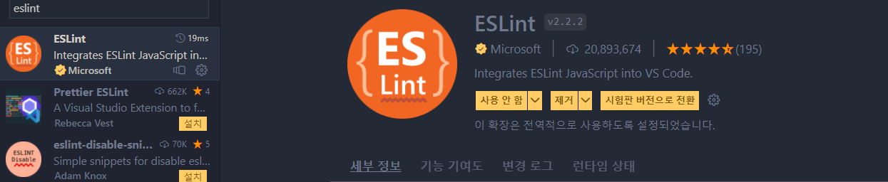

# ESLint 세팅 가이드

## ESLint?

<aside>
💡 ESLint는 자바스크립트 코드의 품질을 관리해주는 Lint 플러그인입니다. 유지보수를 어렵게 하는 요소들을 코드 작성 단계에서 예방할 수 있게 해줍니다.

</aside>

```bash
- 들여쓰기를 맞추지 않은 경우
- 너무 긴 라인…너무 긴 라인…너무 긴 라인…너무 긴 라인…너무 긴 라인…너무 긴 라인…너무 긴 라인…
- 선언한 변수를 사용하지 않는 경우
- 등등...
```

ESLint는 **1) 코드 포매팅**과 **2) 코드 품질 관리**를 도와줍니다.

포매팅은 일관된 코딩 컨벤션을 유지하는 기능인데, Prettier가 좀더 일관적인 스타일로 코드를 만들어줍니다. 우리는 Prettier를 이미 세팅해놨으므로, **2) 코드품질 관리**를 위해 ESLint를 사용합니다.

## ESLint 설치하기

1. **npm으로 eslint를 설치**합니다. `--g` 옵션으로 전역으로 설치할 수 있지만, 우리 프로젝트 내에서 사용할 컨벤션이 다른 프로젝트와 다를 수 있으니 글로벌 옵션 없이 설치합니다.

```bash
npm install eslint --save-dev
```

<aside>
💡 --save-dev 옵션을 사용하면 빌드 시 해당 플러그인이 포함되지 않으며, 프로젝트에 devDependency로 설치됩니다.

</aside>

1. `.eslintrc` 파일을 생성합니다.

```bash
npx eslint --init
```

명령어를 입력하면 질의응답을 하게 됩니다. 답변에 따라 파일이 생성됩니다.

```bash
You can also run this command directly using 'npm init @eslint/config'.
√ How would you like to use ESLint? · style
√ What type of modules does your project use? · esm
√ Which framework does your project use? · react
√ Does your project use TypeScript? · No / Yes
√ Where does your code run? · browser
√ How would you like to define a style for your project? · prompt
√ What format do you want your config file to be in? · JSON
√ What style of indentation do you use? · 4
√ What quotes do you use for strings? · double
√ What line endings do you use? · unix
√ Do you require semicolons? · No / Yes
The config that you've selected requires the following dependencies:

eslint-plugin-react@latest
√ Would you like to install them now? · No / Yes
√ Which package manager do you want to use? · npm
Successfully created .eslintrc.json file in {경로}\FE-easy-404\ESLint
```

## .eslintrc.json 파일 컨벤션에 맞게 수정하기

```json
{
  "env": {
    "browser": true,
    "es2021": true
  },
  "extends": [
    "eslint:recommended",
    "plugin:react/recommended",
    "plugin:prettier/recommend"
  ],
  "parserOptions": {
    "ecmaFeatures": {
      "jsx": true
    },
    "ecmaVersion": "latest",
    "sourceType": "module"
  },
  "plugins": ["react"],
  "rules": {
    "no-unexpected-multiline": "error",
    "linebreak-style": ["error", "unix"]
  }
}
```

## Prettier와 통합하기

코드 포맷터로서 Prettier를, 코드 품질 관리툴로서 ESLint를 함께 사용하기 위해서는 둘을 통합시키는 과정이 필요합니다.

이 때 필요한 것이 `eslint-config-prettier`와 `eslint-plugin-prettier`입니다.

**프리티어 포맷팅 규칙을 eslint에 추가하고, 서로 충돌하는 옵션은 Prettier의 규칙을 사용하도록 하는 도구입니다.**

1. 아래 명령을 통해 두 패키지를 설치합니다.

```bash
npm install eslint-config-prettier eslint-plugin-prettier
```

1. `~~.eslint.json`의 extends에 추가합니다.~~

```json
~~"extends": [
    ...
    "plugin:prettier/recommend"
  ],
...~~
```

## VSC Extention

eslint가 특정 명령어 입력 없이도 상시로 감시할 수 있게 하기 위해, VSC Extention을 설치합니다.



설치 뒤에는 `Ctrl + ,`를 눌러 VSC 설정을 열어주고, 우측 상단의 `설정열기(JSON)` 버튼을 클릭해 `setting.json` 파일을 엽니다.


`setting.json` 파일을 열면 객체 안에 아래의 설정을 추가해줍니다.

```json
{
	**"eslint.enable": true,
  "editor.codeActionsOnSave": {
    "source.fixAll.eslint": true
  },**
	...
}
```

이제 파일을 저장할 때마다 eslint가 틀린 부분을 문법에 맞게 자동으로 수정해줍니다.

하지만 자동으로 수정 가능한 규칙과 자동으로 수정할 수 없는 규칙이 있는데요.

[공식 홈페이지](https://eslint.org/docs/latest/rules/)의 rules에서 🛠️ 아이콘이 활성화되어있으면 자동으로 수정이 가능한 규칙임을 의미합니다.

